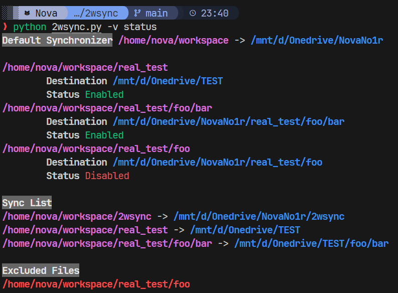

# 2WSYNC

WSL2 和 OneDrive 的同步脚本。写着写着反正就写的依托，就发出来了。启发来源见 [博客](https://n.ova.moe/blog/2024/07/19/WSL2-利用-Robocopy-对-OneDrive-进行增量更新)



## 配置

默认放在 ~/.config/2wsync/config.yml 处，可以使用 `python 2wsync.py init` 配置

```yml
# 同步位置
default_dest: /mnt/d/Onedrive/NovaNo1r
# 源位置
# 默认添加 default_src/ 下的所有 *文件夹* 到监听列表
default_src: /home/nova/workspace
exclude:
  - node_modules # 匹配
  - wide* # 通配符匹配

items:
  - src: real_test # 相对位置
    dest: /mnt/d/Onedrive/TEST # 绝对位置，额外配置一个对应位置

  # 没有配置 dest
  # 从最长最近匹配设置过 dest 的 (在这里是 real_test) 项目，做相对偏移
  # 这里 dest 是 /mnt/d/Onedrive/TEST/foo/bar
  - src: real_test/foo/bar # 相对位置

  - src: real_test/foo
    enabled: false # 禁用，不同步 real_test/foo 的文件
```

可以使用 `python 2wsync.py status` 可视化配置情况
可以使用 `python 2wsync.py start --dry-run` 查看命令执行情况
可以使用 `python 2wsync.py -v <command>` 打印更多 DEBUG 信息
